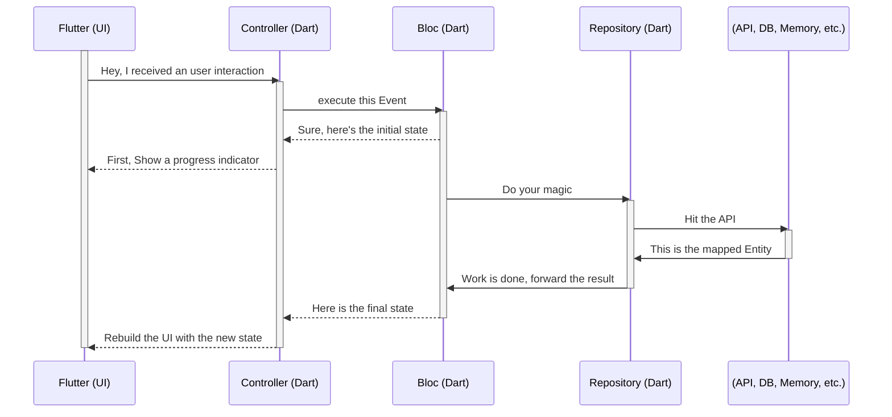

# Club Hub - Tech Challenge

Here you can find Random Users App project

## 🚀 Getting Started

**Application tested with:**

- Flutter 3.19.2 • channel stable
- Framework • revision 7482962148
- Engine • revision 04817c99c9
- Tools • Dart 3.3.0 • DevTools 2.31.1

## 🚧 Prepare environment

- Install [Flutter FVM](https://fvm.app/documentation/getting-started/installation)
- run `fvm global 3.19.2`
- add the next line to your **~/.bashrc** or **~/.zshrc**
```
export PATH=$PATH:/Users/{YOUR_USER}/fvm/default/bin
``` 
**Get all packages in pubspec.yaml, execute the following command:**
```
flutter pub get
```
## 🏃🏻 Run the app
```
flutter run
```

## 🏗️ Run tests
```
flutter test
```

## Folder Structure
```
📁lib
└── main.dart
└── 📁common
    └── 📁constants
        └── <foo>_constants.dart
    └── 📁extensions
        └── <fizs>_extensions.dart
    └── 📁utils
        └── theme.dart
        └── utils.dart
    └── 📁widgets
└── 📁data
    └── 📁model
        └── <feature>_model.dart
    └── 📁exceptions
        └── <feature>_exceptions.dart
    └── 📁source
        └── <feature>_remote.dart
        └── <feature>_local.dart
└── 📁domain
    └── 📁entity
        └── <feature>_entity.dart
    └── 📁usecase
        └── 📁repository
            └── <feature>_repository.dart
└── 📁navigation
    └── <feature>_route.dart
└── 📁presenter
    └── 📁screens
        └── 📁<feature>
            └── 📁bloc
                └── <feature>_bloc.dart
                └── <feature>_event.dart
                └── <feature>_state.dart
            └── <feature>_controller.dart
            └── <feature>_model.dart
            └── <feature>_view.dart
📁test
└── 📁<layer>
    └── <feature>_test.dart
```

## Data Flow



## 📦 How to Run the Web App with Docker

    TBD

## ADR (Architecture Decision Record)

- [ADR-001](https://docs.google.com/document/d/1grFuMU7aMrDAgL1tGQzoQGrYPDRRUOGfAapWPiFm4Vc/edit?usp=sharing)
